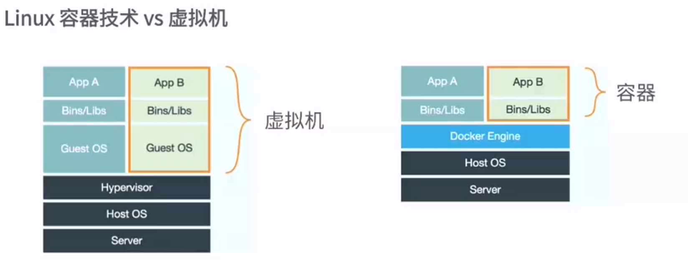

### 一、什么是容器

##### 1.一种虚拟化的方案

##### 2.操作系统级别的虚拟化

##### 3.只能运行相同或相似内核的操作系统

##### 4.依赖于Linux内核特性:Namespace和Cgroups(Control Group)

### 二、容器技术的优势

##### 1.磁盘占用空间更少

##### 2.虚拟机对内存的cpu损耗更大

### 三、什么是Docker

##### 1.将应用程序自动部署到容器

##### 2.Golang开源引擎

### 四、Docker的目标

##### 1.提供简单轻量的建模方式

##### 2.职责的逻辑分离

##### 3.快速高效的开发生命周期

##### 4.鼓励使用面向服务的架构

### 五、Docker的使用场景

##### 1.使用Docker容器开发、测试、部署服务

##### 2.创建隔离的运行环境

##### 3.搭建测试环境

##### 4.构建多用户的平台服务(PaaS)基础设施

##### 5.提供软件即服务(SaaS)应用程序

##### 6.高性能、超大规模的宿主机部署

### 六、Docker三大要素

##### 仓库:集中存放镜像文件的场所

##### 镜像:容器实例化的模板

##### 容器:是镜像创建的运行实例，相当于一个简易版的Linux环境

##### 注:最大的公开仓库是Docker Hub
